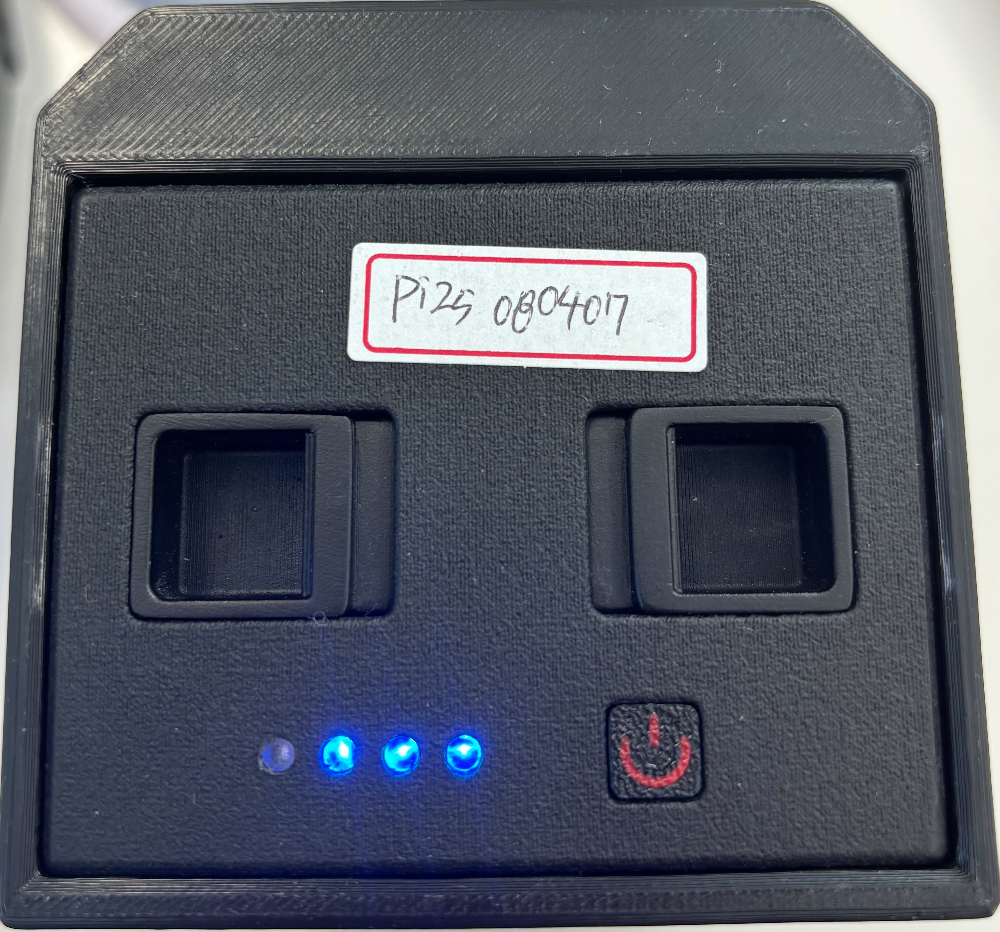
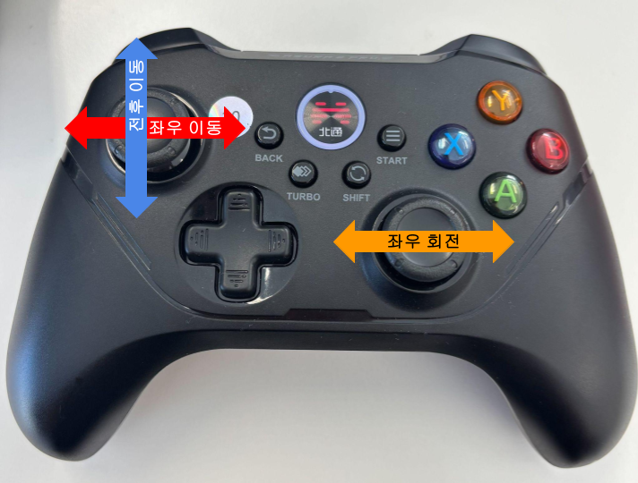
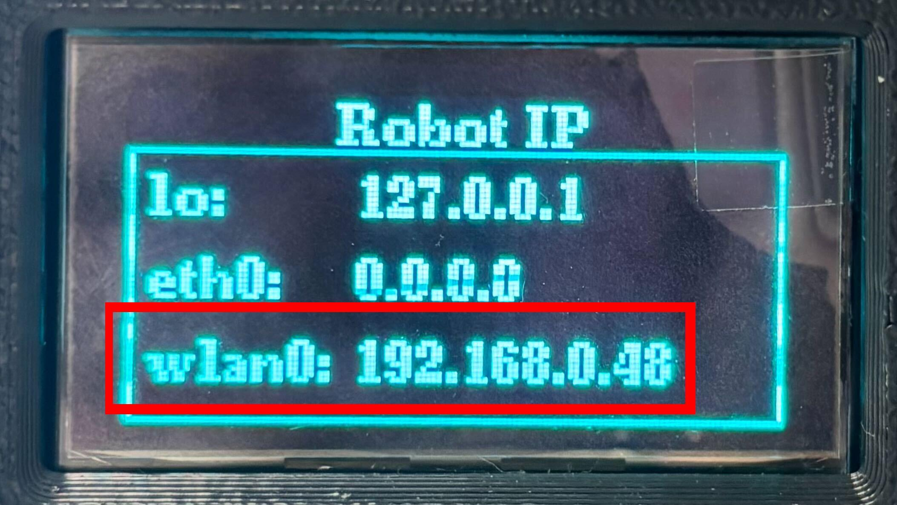
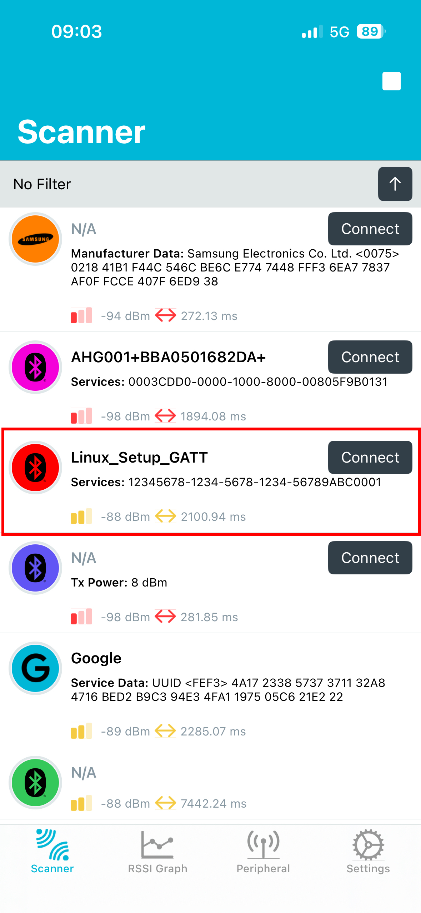
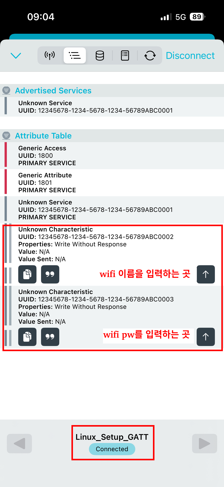
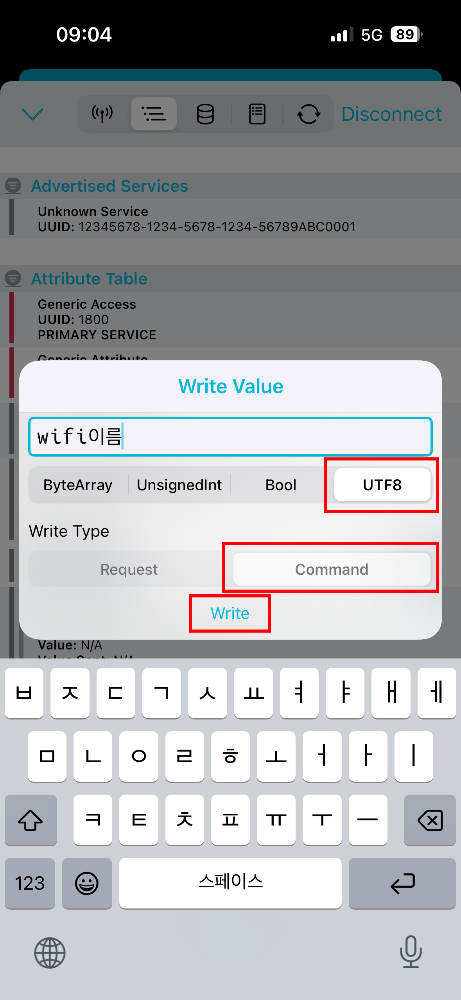
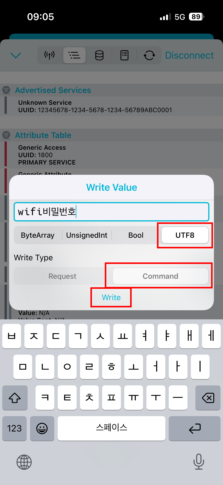
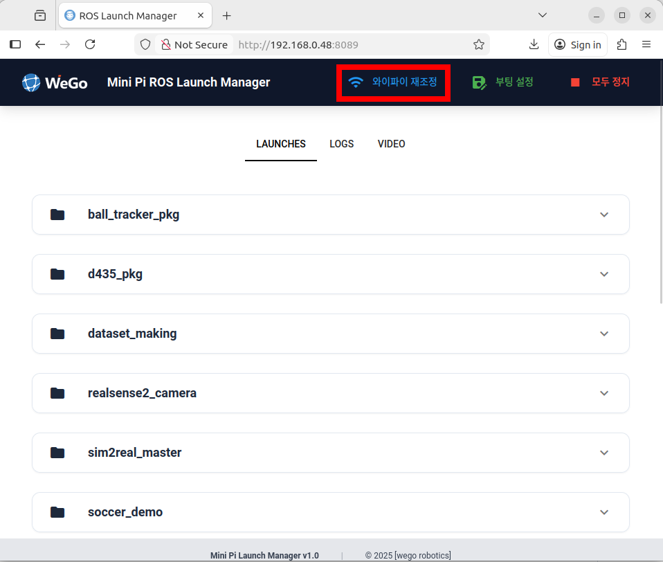
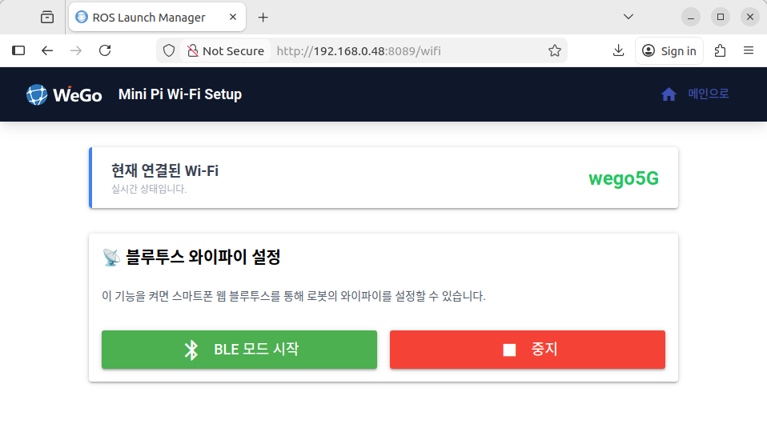

# Mini Pi manual

### 처음 로봇을 개봉할 때
맨 처음 로봇을 개봉하여 사용하기 까지의 단계는 다음과 같습니다.
1. 로봇 전원 인가
2. 로봇 와이파이 연결
3. 조이패드로 로봇 구동하기

#### 1. 로봇 전원 인가
<table>
  <tr>
    <td width="50%" valign="top">
      <h4>동봉된 배터리 잔량 확인</h4>
      <p>버튼을 가볍게 한 번 누르면 잔량에 맞게 켜지는 조명의 수가 달라집니다. 최소 2개 이상의 조명이 켜졌을 때 사용하시는 것을 추천드립니다.</p>
    </td>
    <td width="50%" align="center">
      
    </td>
  </tr>
  <tr>
    <td width="50%" valign="top">
      <h4>배터리 켜고 끄기</h4>
      <p>배터리를 켜거나 끌 때는 버튼을 두번 눌러줍니다. 두번째 누를 때 길게 눌러주세요.</p>
    </td>
    <td width="50%" align="center">
      
    </td>
  </tr>
  <tr>
    <td width="50%" valign="top">
      <h4>배터리 충전</h4>
      <p>배터리 충전 시에도 버튼을 두번 눌러주면 충전 현황을 확인할 수 있습니다. 완충되었을 때, 조명이 다 꺼져있습니다.</p>
    </td>
    <td width="50%" align="center">
      
    </td>
  </tr>
</table>


#### 2. 로봇 와이파이 연결
아래 [초기 와이파이 연결](#초기-와이파이-연결)을 참고해주세요.
현재, **minipi는 와이파이가 연결되어있지 않으면 구동을 할 수 없도록 하였습니다.**

와이파이가 연결되면, 아래 사진과 같이 로봇 LCD 창이 변하고 로봇이 일어섭니다. **해당 과정이 진행되는 동안, 주변에 어린아이나 동물이 다가가지 못하게 하십시오. 또한, 관절 부분에 접촉할 시, 끼임 위험이 있습니다.**


<br>


#### 3. 조이패드로 로봇 구동하기
로봇이 일어섰다면, 조이패드를 이용해 로봇을 이동시킬 수 있습니다.
아래 사진을 참고해주세요.


<br>

기타 기본 사용법은 **Mini Pi Textbook**을 참고해주세요

---

### Ip 확인
mini pi를 와이파이에 연결한 후, ip를 확인하기 위해 번거롭게 터미널을 열 필요가 없습니다.

mini pi 뒷면의 LCD 화면 옆 스위치를 조종하여 다양한 상태 화면을 확인할 수 있습니다.
그 중, Robot IP 화면에서 로봇의 ip를 확인할 수 있습니다.



<br>

만약 터미널로 확인할 경우, 다음 명령어를 입력해주세요.
```bash
hightorque@lubancat:~$ ifconfig

# ...(중략)

wlan0: flags=4163<UP,BROADCAST,RUNNING,MULTICAST>  mtu 1500
        inet 192.168.0.48  netmask 255.255.255.0  broadcast 192.168.0.255
        inet6 fe80::41fc:423d:be0a:b04  prefixlen 64  scopeid 0x20<link>
        ether dc:4a:9e:36:8b:1f  txqueuelen 1000  (Ethernet)
        RX packets 5942  bytes 1537953 (1.5 MB)
        RX errors 0  dropped 0  overruns 0  frame 0
        TX packets 3228  bytes 2735445 (2.7 MB)
        TX errors 0  dropped 0 overruns 0  carrier 0  collisions 0
```

wlan0의 inet을 이용하여 원격접속에 사용할 수 있습니다

---

### 초기 와이파이 연결

처음 로봇을 개봉하여 부팅 후, 약 1분 간 기다리면 로봇과 블루투스 연결을 할 수 있습니다.

다음과 같은 절차를 따라해주세요.

<table>
  <tr>
    <td width="50%" valign="top">
      <h4>1. 앱 설치 및 장치 검색</h4>
      <p>먼저, <b>nRF Connect</b> 앱과 같이 블루투스 연결 및 정보 전송 앱을 다운로드해 주세요.</p>
      <p>앱 실행 후 스캐너 목록에서 <b>Linux_SETUP_GATT</b>라는 이름의 장치가 나타나면 <b>Connect</b> 버튼을 눌러 연결합니다.</p>
    </td>
    <td width="50%" align="center">
      
    </td>
  </tr>
  <tr>
    <td width="50%" valign="top">
      <h4>2. 서비스 UUID 확인</h4>
      <p>연결이 완료되면 서비스 목록이 나타납니다.</p>
      <p>표시된 것과 같이 <b>Unknown Service</b> 목록 중:</p>
      <ul>
        <li><b>...0002</b>: 와이파이 이름(SSID) 입력</li>
        <li><b>...0003</b>: 와이파이 비밀번호(PW) 입력</li>
      </ul>
      <p>각각의 화살표(⬆️) 버튼을 눌러 입력을 준비합니다.</p>
    </td>
    <td width="50%" align="center">
      
    </td>
  </tr>
    <tr>
    <td width="50%" valign="top">
      <h4>3. 와이파이 이름 입력</h4>
      <p>0002로 끝나는 uuid에 연결하고자하는 와이파이 이름을 입력하고 전송하세요. utf8 형식, commend 형식으로 전송합니다.</p>
    </td>
    <td width="50%" align="center">
      
    </td>
  </tr>
    </tr>
    <tr>
    <td width="50%" valign="top">
      <h4>4. 와이파이 비밀번호 입력</h4>
      <p>0003으로 끝나는 uuid에 연결하고자하는 와이파이 비밀번호를 입력하고 전송하세요. utf8 형식, commend 형식으로 전송합니다.</p>
    </td>
    <td width="50%" align="center">
      
    </td>
  </tr>
</table>
조금 기다리고 LCD 패널의 스위치를 옆으로 켜면 맨 위의 사진과 같이 wlan0으로 ip 주소가 나타납니다.

이후로는 해당 네트워크가 있으면 자동으로 연결됩니다.

네트워크를 변경하고 싶은 경우, 아래 **gui를 통한 와이파이 변경**을 참고해주세요

---

### gui를 통한 와이파이 변경
gui 사용과 관련된 상세한 설명은 [web_GUI 매뉴얼](/wego_minipi_ws/etc/docs/manual/web_GUI.md)에 있으며, 해당 페이지에서는 gui를 통한 와이파이 변경 방법을 안내해드립니다.

네트워크가 연결되고, 로봇이 제자리에서 일어섰다면 gui에 접속할 수 있습니다.
LCD 패널에 표시된 wlan0 주소를 사용하여 http://wlan0:8089(본 매뉴얼에서는 http://192.168.0.48:8089)로 접속하면 아래와 같은 화면이 나타납니다. 네트워크가 연결된 상태에서 다른 네트워크로 변경하고 싶다면, gui의 '와이파이 재조정'페이지에 접속하세요.


<br>

와이파이 재조정 페이지에 접속하면, 아래와 같이 나타납니다. BLE 모드 시작을 누르고, 위의 초기 단계에서 블루투스 스캐너 앱을 통해 변경할 와이파이의 이름과 비밀번호를 입력하시면 됩니다. 

현재 연결된 Wi-Fi 이름이 변경되면 중지 버튼을 눌러주세요.


<br>
