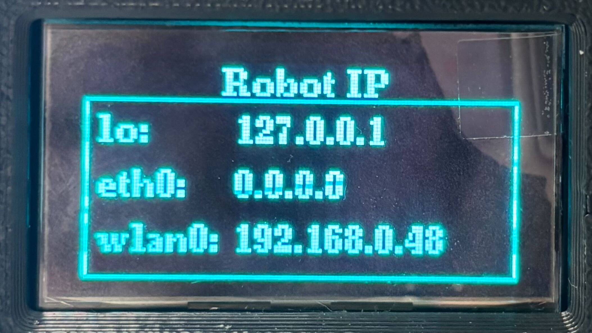
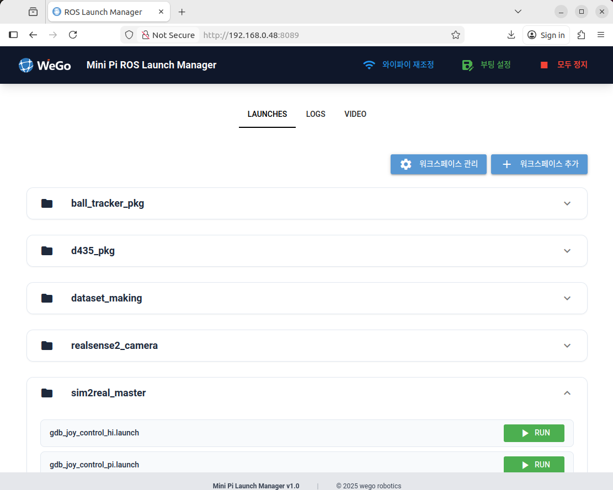
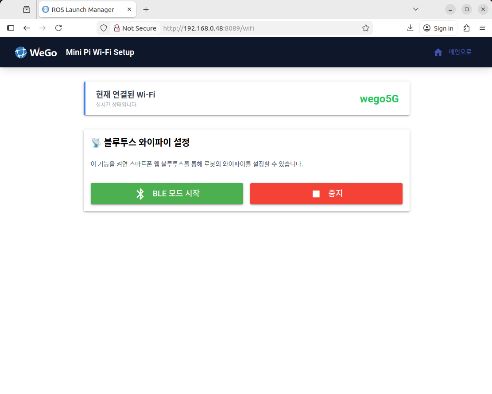
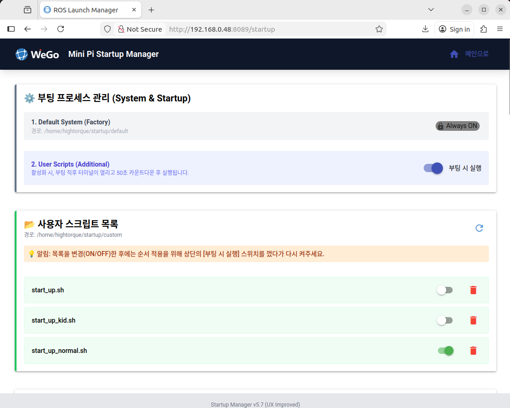
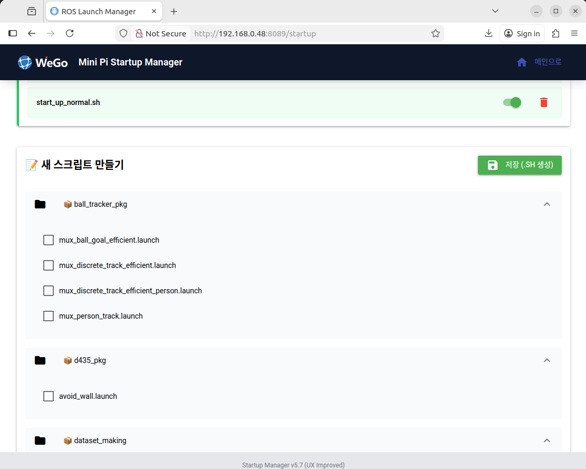

# Mini Pi manual

## Ip 확인
mini pi를 와이파이에 연결한 후, ip를 확인하기 위해 번거롭게 터미널을 열 필요가 없습니다.

mini pi 뒷면의 LCD 화면 옆 스위치를 조종하여 다양한 상태 화면을 확인할 수 있습니다.
그 중, Robot IP 화면에서 로봇의 ip를 확인할 수 있습니다.


<br>

만약 터미널로 확인할 경우, 다음 명령어를 입력해주세요.
```bash
hightorque@lubancat:~$ ifconfig

# ...(중략)

wlan0: flags=4163<UP,BROADCAST,RUNNING,MULTICAST>  mtu 1500
        inet 192.168.0.48  netmask 255.255.255.0  broadcast 192.168.0.255
        inet6 fe80::41fc:423d:be0a:b04  prefixlen 64  scopeid 0x20<link>
        ether dc:4a:9e:36:8b:1f  txqueuelen 1000  (Ethernet)
        RX packets 5942  bytes 1537953 (1.5 MB)
        RX errors 0  dropped 0  overruns 0  frame 0
        TX packets 3228  bytes 2735445 (2.7 MB)
        TX errors 0  dropped 0 overruns 0  carrier 0  collisions 0
```

wlan0의 inet을 이용하여 원격접속에 사용할 수 있습니다.

## minipi gui 실행
네트워크에 연결되어있기만 하면 nomachine이나 ssh를 사용하지 않고 웹 gui로 간단히 minipi를 사용할 수 있도록 했습니다.

`http://minipi의_ip주소:8089`를 통해 gui에 접속하세요. 아래와 같은 화면이 나타납니다.

`워크스페이스 추가` 버튼을 통해 직접 만든 워크스페이스를 추가할 수 있으며, `워크스페이스 관리` 버튼을 통해 워크스페이스 내 패키지를 숨길 수 있습니다.

<br>

네트워크를 변경하고 싶다면, `와이파이 재조정` 페이지로 이동하여 설정해줍니다.

<br>

로봇을 부팅할 때 자동으로 구동시키고 싶은 launch가 있다면, `부팅 설정` 페이지로 이동합니다. `사용자 스크립트 목록`에서 부팅 시 실행할 스크립트를 활성/비활성화할 수 있습니다.

<br>

새 스크립트를 만들어 실행할 수도 있습니다.

<br>