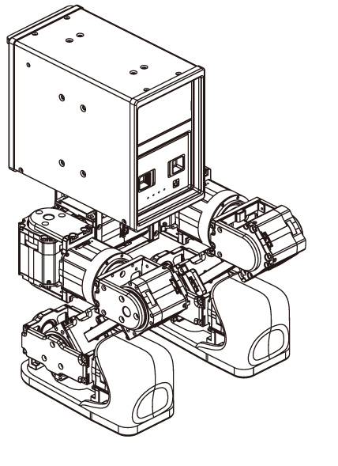
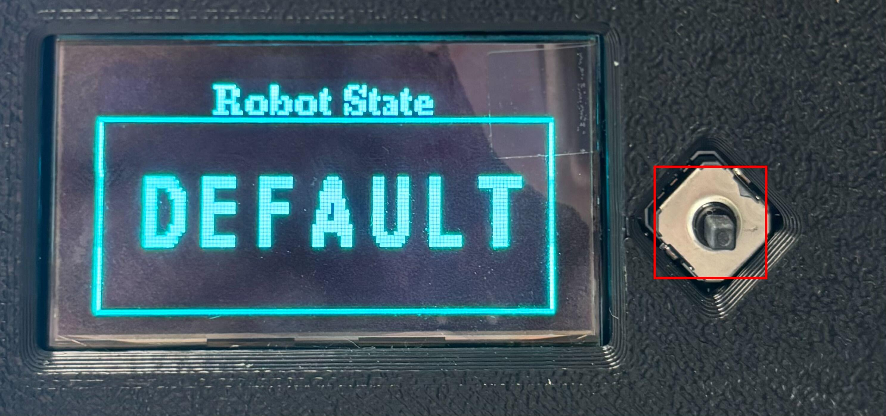
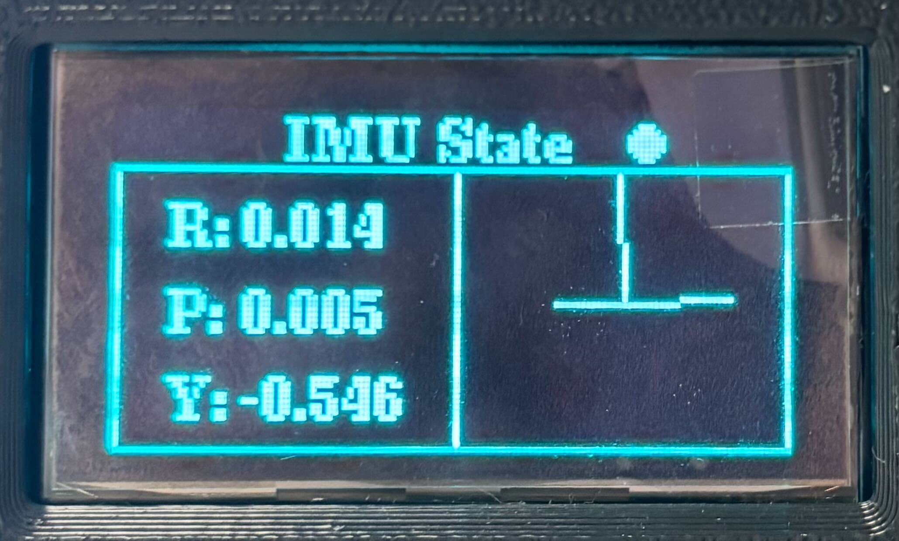
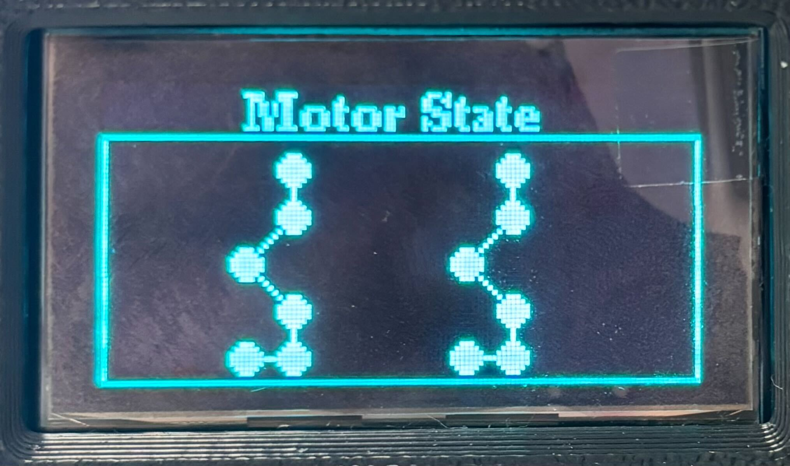
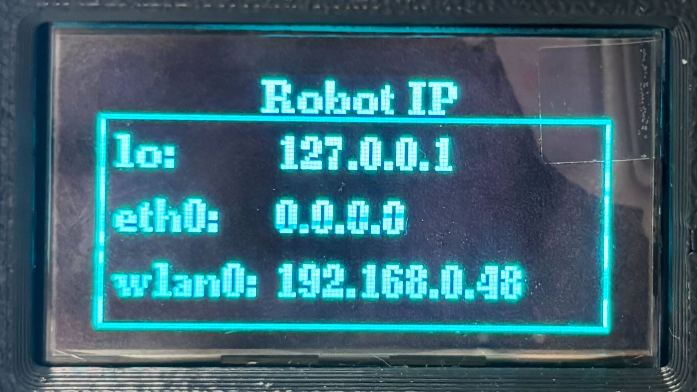
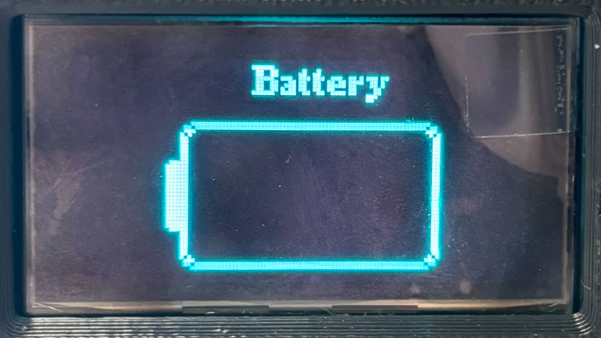
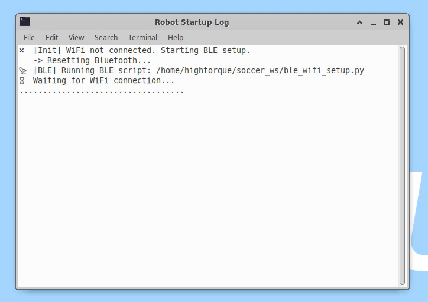

# Mini Pi 출고 시 작업 지시사항

출고 전 아래 사항들을 수행합니다.

0. 하드웨어 점검
1. nomachine 설치
2. python 셀치
3. startup 등록
4. wego_minipi_ws 설치
5. 부가 설치 사항


## 0. 하드웨어 점검
mini pi를 켜고, 동작이 되는지, LCD 디스플레이 창은 뜨는지 확인합니다.
우선, 로봇을 앉은 자세로 세팅합니다.



  이후, 배터리 버튼은 두 번 눌러 (따닥-) 켠 후 로봇에 끼워줍니다.
  뒷면의 두 버튼 중 큰 버튼을 한 번 가볍게 눌러 모터를 켜줍니다.
  이후 작은 버튼을 3초간 눌러 컴퓨터를 켜줍니다.

LCD 디스플레이가 'DEFAULT'라고 표시되면, 조이패드의 LT+RT+start 버튼을 눌러 일으켜줍니다.
이후 왼쪽 상단의 스틱을 상하 좌우로 움직이며 로봇이 앞뒤, 좌우로 움직이는지, 오른쪽 하단의 스틱을 좌우로 움직여 로봇이 좌우로 회전하는지 확인하세요.
이후, RB를 눌러 로봇이 안정적으로 앉는지 확인합니다.

LCD 디스플레이에서 사진과 같은 스위치를 좌우로 움직이며 다음 화면들이 잘 뜨는지 확인합니다.
|항목|사항|
|-----|-----|
|상태표시|INITIAL, DEFAULT 등의 글자가 나옵니다|
|IMU 상태표시|로봇의 머리를 기울임에 따라 변화합니다|
|모터 상태 표시|모든 관절에 파란 불이 켜져있습니다|
|로봇 IP 표시|맨 아랫줄에 현재 접속된 네트워크가 나타납니다|
|배터리 잔량|현재는 빈칸으로 나타나지만, 배터리 잔량이 나옵니다|


<div style="display: flex; justify-content: space-between; gap: 10px;">
    
    
    
    
    
</div>

## 1. nomachine 설치

[nomachine for arm](https://download.nomachine.com/download/?id=30&platform=linux&distro=arm)에 접속하여 ARM 64-bit 버전으로 다운받습니다.

  

## 2. python 설치

mini pi에는 기본적으로 python3.8 버전이 설치되어있습니다. llm이나 gui등을 사용하기 위해서는 python3.10 버전을 사용해야 합니다.

```bash
sudo apt  update
sudo apt  install  software-properties-common
sudo add-apt-repository  ppa:deadsnakes/ppa
sudo apt  update
sudo apt  install  python3.10  python3.10-distutils  python3.10-venv
```

이를 수행 후, 다음 명령어로 설치를 확인합니다.

```bash
python3 --version
# Python 3.8.x

python3.10 --version
# Python 3.10.x
```
 
## 3. 미니파이 프로그램 설치 및 시작 프로그램 등록

아래 setting.sh를 실행하여 startup 내 .sh파일들이 든 startup폴더, .desktop과 wego_minipi_ws를 지정된 장소에 둡니다.

```bash
cd startup && ./setting.sh
cd /home/hightorque/wego_minipi_ws
pip install  -r  requirements.txt
```

로봇을 재부팅 했을 때 다음과 같이 터미널들이 나타나면 정상 설치된 것입니다.



### a. 시작 프로그램 등록

mini pi에는 기본적으로 로봇이 부팅될 때 로봇 구동 코드를 실행하도록 하는 start up이 세팅되어있습니다.

추가된 기능(일어서기, 웹 gui 켜기 등)들이 있으므로, 새로운 start up을 등록합니다.
<br> 

  

mini pi의 기본 디렉토리 (/home/hightorque)에 startup 내 startup 폴더를 저장한 후 권한을 부여합니다.  
- master_autostart.sh: 아래 두 기능을 한 번에 묶은 것입니다.
- run_standup_only.sh: 로봇 부팅 후 스스로 일어나고 잠김을 해제합니다.
- soccer_web_gui.sh: 웹 gui 접속을 할 수 있도록 합니다.
  <br>  

이후, 바탕화면에 startup 내 두 .desktop파일을 저장합니다.
- joy_Switch_alg.desktop: 기본 로봇 구동 실행입니다.
- robot_wego.desktop: master_autostart.sh를 실행합니다.

또한, .config/autostart에 robot_wego.desktop을 지정하여 재부팅 및 재로그인 시 구동되도록 설정합니다.

wego_minipi_ws는 mini를 활용하여 다양한 기능을 할 수 있도록 한 워크스페이스입니다.
공 추적, llm 기반 대화 등 다양한 기능에 대한 패키지가 들어있습니다.

## 4. 부가 설치 사항

rkllama와 hugging face에서 다운받은 모델을 다운받아야 mini pi의 NPU를 활용한 LLM 사용이 가능합니다.
[rkllama github](https://github.com/NotPunchnox/rkllama/tree/Beta)를 클론합니다.
  

클론 후, `git checkout Beta`를 통해 Beta 브랜치를 사용하도록 합니다.

이후, [rkllama에서 사용하는 모델](https://huggingface.co/c01zaut/Qwen2.5-3B-Instruct-RK3588-1.1.4)을 설치합니다.

```bash
rkllama pull
Repo ID ( example:  punchnox/Tinnyllama-1.1B-rk3588-rkllm-1.1.4): <your response>
File ( example:  TinyLlama-1.1B-Chat-v1.0-rk3588-w8a8-opt-0-hybrid-ratio-0.5.rkllm): <your response>
```